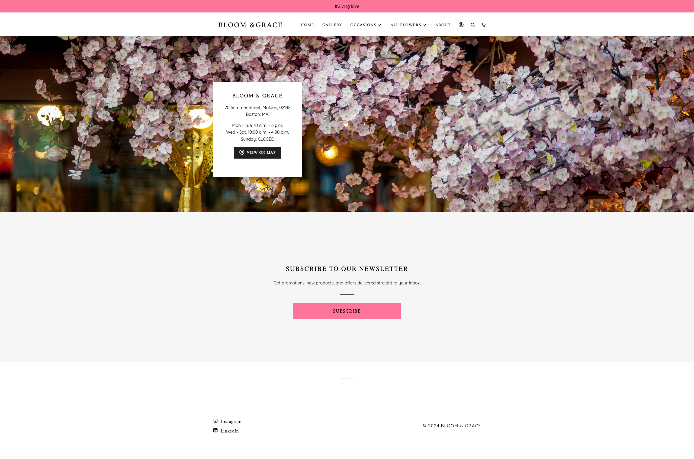
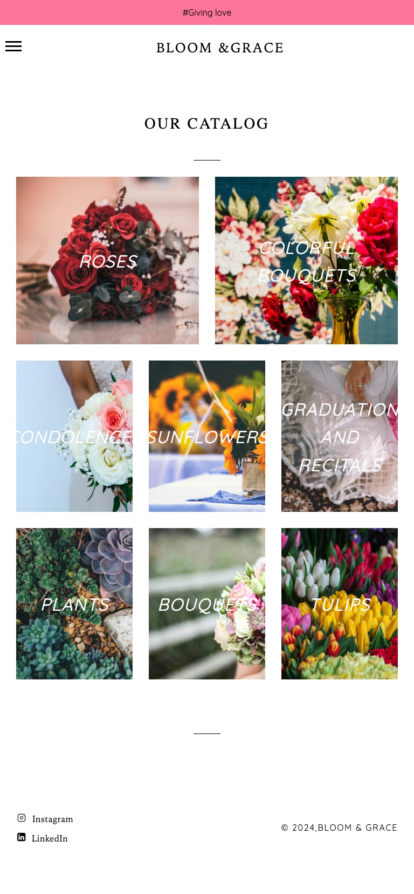
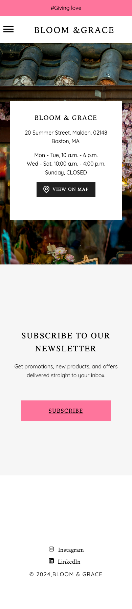

# 🌸 FlowerShop Website

**FlowerShop Website** is a modern flower shop web application built with React, responsive to all devices and designed with accessibility in mind. It provides users with an elegant and seamless experience for browsing beautiful floral products and placing orders online, while ensuring inclusivity for users with disabilities through accessibility features like ARIA roles, keyboard navigation, and proper semantic HTML.

---

## ✨ Project Overview

This project is a Single Page Application (SPA) designed to enhance user interaction with the following features:
 
- Set use profile information
- Explore a variety of floral arrangements with detailed descriptions and images.
- Navigate through categories to find flowers for different occasions.
- Accessibility support for screen readers, keyboard navigation, and high contrast mode, ensuring a user-friendly experience for everyone.

---

## 🛠️ Tech Stack

This project is developed using the following technologies:

- **React**: For building the user interface.
- **React Router(unfinish)**: To enable smooth navigation between pages.
- **CSS/Styled Components**: For styling and creating responsive layouts.

---

## 🚀 Features

- **Responsive Design**: Optimized for mobile, tablet, and desktop devices.
- **Product Showcase**: Displays floral products with high-quality images and descriptions.
- **Shopping Cart(unfinish)**: Allows users to add, edit, and remove items.
- **Search**: Helps users find flowers quickly.
- **Profile Setting**: Let user to set their profile
- **Subscription Modal**: a pop up modal for subscription

---

## 🌟 Preview

Here are some screenshots of the project:

1. **Homepage**  
   

2. **Gallery Page**  
   

3. **Mobile View**  
   

---

